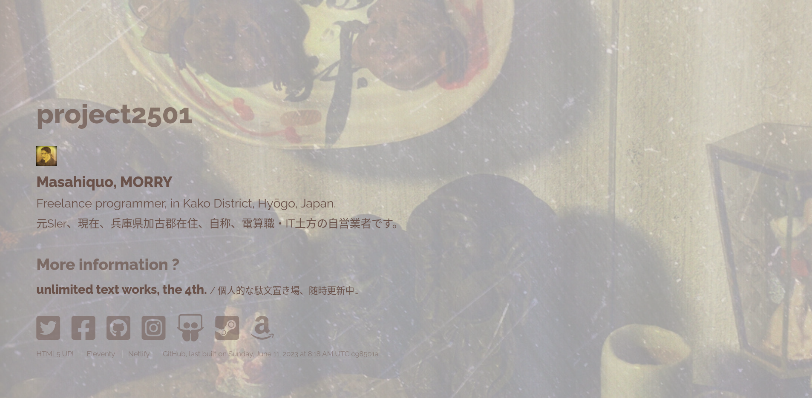

[project2501](https://project2501.netlify.app) is [@dollplayer2501](https://github.com/dollplayer2501)'s portal site.

- Site template is [Eventually, HTML5 UP!](https://html5up.net/eventually).
- Back end system is [Eleventy](https://www.11ty.dev/) and Gulp.
    - Eleventy
        - [@11ty/eleventy-plugin-directory-output plugin](https://www.npmjs.com/package/@11ty/eleventy-plugin-directory-output)
        - [html-minifier](https://www.npmjs.com/package/html-minifier)
        - ~~[eleventy-sass plugin](https://www.npmjs.com/package/eleventy-sass)~~
    - Gulp
        - [gulp-sass](https://www.npmjs.com/package/gulp-sass), [sass](https://www.npmjs.com/package/sass), [gulp-sourcemaps](https://www.npmjs.com/package/gulp-sourcemaps)
        - [gulp-uglify](https://www.npmjs.com/package/gulp-uglify)
        - ~~[gulp-libsquoosh](https://www.npmjs.com/package/gulp-libsquoosh)~~
        - [gulp-webp](https://www.npmjs.com/package/gulp-webp) with [lastrun](https://gulpjs.com/docs/en/api/lastrun/)
        - [gulp-mode](https://www.npmjs.com/package/gulp-mode)
    - npm scripts
        - [cross-env](https://www.npmjs.com/package/cross-env)
        - [npm-run-all](https://www.npmjs.com/package/npm-run-all)
        - [rimraf](https://www.npmjs.com/package/rimraf)
        - [npm-check-updates](https://www.npmjs.com/package/npm-check-updates)
- 2023-06-11
    - Changing NPM pachage manager from [nvm](https://github.com/nvm-sh/nvm) to [rtx](https://github.com/jdxcode/rtx)
    - Updates to Node.js and various NPM packages, without Elenenty
    - ~~Todo, Using [gulp-webp](https://www.npmjs.com/package/gulp-webp)~~  
        ~~In order words, regardless of the image format, the policy is to convert to `webp`.~~

//
